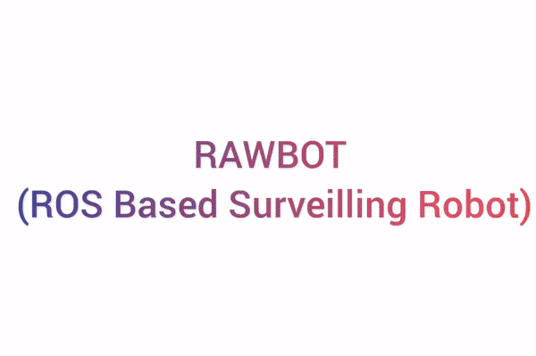

# Raspberry Pi(#38) Raspbian ROS Kinetic Workspace
# Author
* Name : Rajendra Singh
* Email  : singh.raj1997@gmail.com
* Web    : https://iamrajee.github.io/
* LinkedIn    : https://www.linkedin.com/in/rajendra-singh-6b0b3a13a/

# Package description
* ## [firstpkg](src/firstpkg)
*first pkg to create simple talker and listener.*

Terminal 1:
```
$ roscore
$ rosrun firstpkg talker.py
```
Terminal 2:
```
$ rosrun firstpkg listen.py
```


* ## [manualcontrol](src/manualcontrol)
\
See full video [here](https://youtu.be/wrBw4yES4Eo).
*In this pkg is create for a robot name RAWBOT,which is surveling robot.*\

* ## [manualcontrol_slave](src/manualcontrol_slave)
*This pkg is similar to manualcontrol with some more functionality and modification, and it is meant to be used on ROS Master which is used as Slave in system on robots*

# Helper Scripts

* ## refresh.sh
```
#!/bin/bash
source /opt/ros/kinetic/setup.bash
source ~/ros_catkin_ws/devel/setup.bash
source ~/ros_catkin_ws/devel_isolated/setup.bash
clear
```
*It will source the workspace after buiding workspace or after creating new pkg. Run it as `./refresh.sh`*

* ## makefile
```
SHELL=/bin/bash
all:
	make run
run:
	catkin_make #catkin_make_isolated
	bash refresh.sh
```
*It will build the workspace . Run it as `make`*

* ## createpkg.sh
```
#!/bin/bash
cd src/
catkin create $1
cd ../
make
source refresh.sh
```
*It will create new package . Run it as `./createpkg.sh newpkg_name`*

* ## tftree.sh
```
#!/bin/bash
rosrun rqt_tf_tree rqt_tf_tree
```
*It will  launch the gui to visvualise the tf tree. Run it as `./tftree.sh`*

* ## printenv.sh
```
#!/bin/bash
printenv | grep -i ROS
```
*It will print the ROS related environment variable . Run it as `./printenv.sh`*

* ## rosdep.sh
```
sudo rosdep install -i --from-path src --rosdistro $ROS_DISTRO -y
```
*It will install dependencies of all pkg in the workspace . Run it in workspace as `./rosdep.sh`*

* ## rajendra.sh
```
#!/bin/bash
ssh rajendra@rajendra
```
*It will ssh into another system. Useful when using muliple ros masters. Run it as `./rajendra.sh`*

* ## googleassistant.sh
```
#!/bin/bash
{ # try
	googlesamples-assistant-hotword --project-id first-66e46 --device-model-id first-66e46-firstproduct-hx0n7j
	#googlesamples-assistant-pushtotalk --project-id first-66e46 --device-model-id first-66e46-firstproduct-hx0n7j
} || { # catch
    # save log for exception
	bash refresh.sh
}
```
*It will run the googleassistant api in terminal. I used this on RAWBOT 1.0 for audio commads . Run it as `./googleassistant.sh`*

## Team

> Or Contributors/People

| <a href="http://fvcproductions.com" target="_blank">**FVCproductions**</a> | <a href="http://fvcproductions.com" target="_blank">**FVCproductions**</a> | <a href="http://fvcproductions.com" target="_blank">**FVCproductions**</a> |
| :---: |:---:| :---:|
| [](https://github.com/MuskaanMaheshwari)    | [](http://fvcproductions.com) | [](http://fvcproductions.com)  |
| <a href="http://github.com/fvcproductions" target="_blank">`github.com/fvcproductions`</a> | <a href="http://github.com/fvcproductions" target="_blank">`github.com/fvcproductions`</a> | <a href="http://github.com/fvcproductions" target="_blank">`github.com/fvcproductions`</a> |

- You can just grab their GitHub profile image URL
- You should probably resize their picture using `?s=200` at the end of the image URL.

---

## FAQ

- **I ran into xyz issue while running above package, what do I do?**
    - Simply contact me!

---

## Support

Reach out to me at one of the following places!

- Website at <a href="https://iamrajee.github.io/" target="_blank">`iamrajee.github.io/`</a>
- Twitter at <a href="https://twitter.com/i_am_rajee" target="_blank">`@i_am_rajee`</a>
- Email  : singh.raj1997@gmail.com
- LinkedIn at <a href="https://www.linkedin.com/in/rajendra-singh-6b0b3a13a/" target="_blank">`@Rajendra Singh`</a>

---

## License

[](http://badges.mit-license.org)

- **[MIT license](http://opensource.org/licenses/mit-license.php)**
- Copyright (c) 2019 Rajendra Singh.
